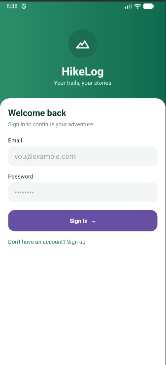
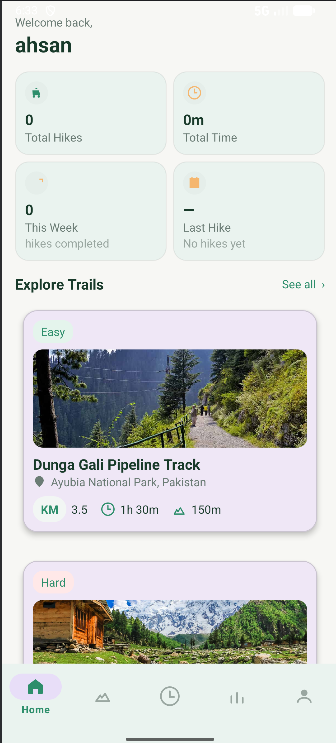
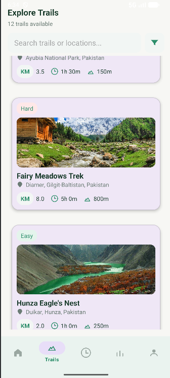
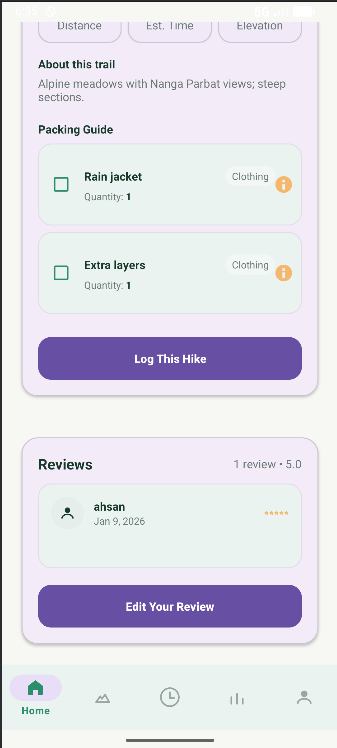
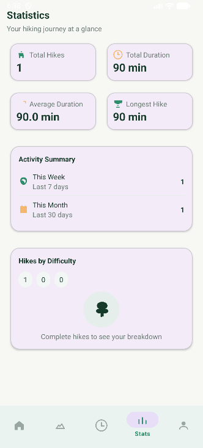
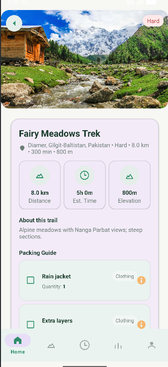

# 🥾 HikeLog — Android Hiking Log App

An **offline, local-only Android application** for discovering trails, logging hikes, tracking wildlife sightings, and viewing personal hiking statistics — built with **Material Design components** and **SQLite**.

<p align="center">
  
</p>

---

## ✨ Features

* 🔍 Explore trails with **search** and **difficulty filters**
* 📍 View rich trail details:

  * Description
  * Packing guide
  * User reviews
* 📝 Log completed hikes with:

  * Date
  * Duration
  * Notes
* 🗂 Browse hike history with quick summaries
* 🦌 Record wildlife sightings per hike
* 📈 Visualize elevation profiles with interactive charts
* 📊 Personal stats dashboard:

  * Total hikes
  * Weekly summary
* 👤 Profile management:

  * Edit name
  * Clear hike data
  * Logout

---

## 📱 Screens & Navigation

### Bottom Navigation Tabs

#### 🏠 Home

<p align="center">
  
</p>

#### 🥾 Trails

<p align="center">
  
</p>

#### 📜 History

<p align="center">
  
</p>

#### 📊 Stats

<p align="center">
  
</p>

#### 👤 Profile

<p align="center">
  
</p>

---

## 🧭 Navigation & Key Components

### Core Navigation

* `MainActivity.java`
* `activity_main.xml`

### Authentication

* `LoginActivity.java`
* `RegisterActivity.java`

### Trails

* `TrailsFragment.java` — search & difficulty filters
* `TrailDetailsActivity.java` — detailed trail view

### History

* `HikeAdapter.java` — hike list adapter
* `HikeDetailsActivity.java` — hike detail screen

### Stats

* `StatsFragment.java`

### Profile

* `ProfileFragment.java`

> ℹ️ **Note:** Always use **relative paths** in README files. Local `file:///` links do not work on GitHub.

---

## 🗄 Data & Persistence

All data is stored **locally on-device** using **SQLite**.

### Database Layer

* `HikeLogContract.java` — table & column definitions
* `HikeLogDbHelper.java` — database creation & migration

### Repositories

* `TrailRepository.java`
* `TrailReviewRepository.java`
* `HikeRepository.java`
* `WildlifeRepository.java`

### Seed Data

* Preloaded trails
* Packing checklist items
* Common wildlife entries

---

## 🎨 UI Highlights

* Material **Cards** with rounded corners
* Consistent spacing:

  * 16–20dp outer margins
  * 8–12dp inner padding
* Rounded text inputs
* `BottomNavigationView` with:

  * Custom icon tint
  * Text color state lists
  * Ripple feedback
* 📊 Charts:

  * **MPAndroidChart – LineChart**
  * Touch gestures & pinch-to-zoom for elevation profiles

---

## 🛠 Build & Run

### Requirements

* Android Studio (latest stable)
* Android SDK

### Build

```bash
# Windows
.\gradlew.bat assembleDebug

# macOS / Linux
./gradlew assembleDebug
```

### Run

* Open the project in **Android Studio**
* Click **Run ▶** on a connected device or emulator

---

## 🧪 Testing & Linting

### Unit Tests (if available)

```bash
# Windows
.\gradlew.bat test

# macOS / Linux
./gradlew test
```

### Lint

```bash
# Windows
.\gradlew.bat lint

# macOS / Linux
./gradlew lint
```

---

## 📂 Folder Structure

```
app/src/main/
├─ java/com/example/myapplication/
│  ├─ ui/
│  │  ├─ home
│  │  ├─ trails
│  │  ├─ history
│  │  ├─ stats
│  │  ├─ profile
│  │  └─ auth
│  ├─ data/
│  │  ├─ db          # SQLite contracts & helpers
│  │  └─ repository # CRUD repositories
│  └─ model          # Entities (Trail, Hike, Review, Wildlife)
│
├─ res/
│  ├─ layout         # XML layouts
│  ├─ menu
│  ├─ drawable
│  └─ values         # colors, styles, themes
│
└─ docs              # Generated artifacts (if any)
```

---

## 🧩 Notable Layout Files

### Authentication

* `activity_login.xml`
* `activity_register.xml`

### Trails

* `fragment_trails.xml`
* `activity_trail_details.xml`

### History

* `item_hike.xml`
* `activity_hike_details.xml`

### Stats & Profile

* `fragment_stats.xml`
* `fragment_profile.xml`

---

## 🔒 Security & Privacy

* 🔐 **Local-only storage** — no remote sync
* 🚫 No hardcoded secrets
* 🧹 Avoid logging sensitive user data

---

## 🤝 Contributing

* Fork the repository
* Create a feature branch
* Submit a Pull Request
* Follow existing code style and UI patterns
* Keep accessibility and consistency in mind

---

## 📄 License

No license is currently specified.

---

🌄 *HikeLog — track your hikes, offline and distraction-free.*
